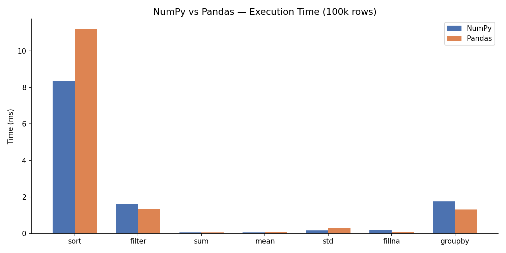
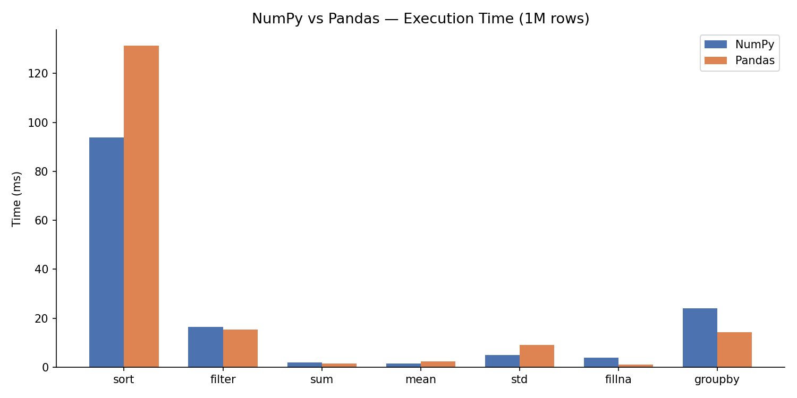
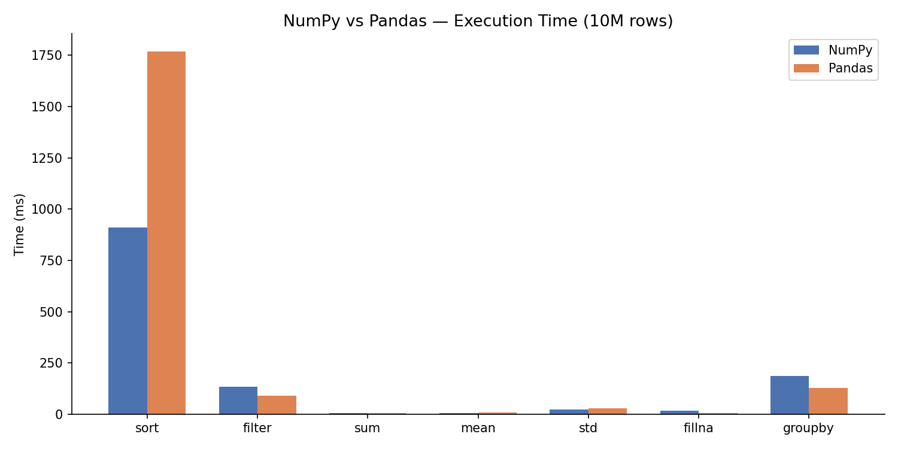
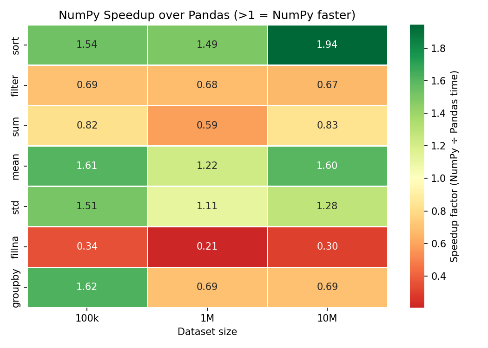
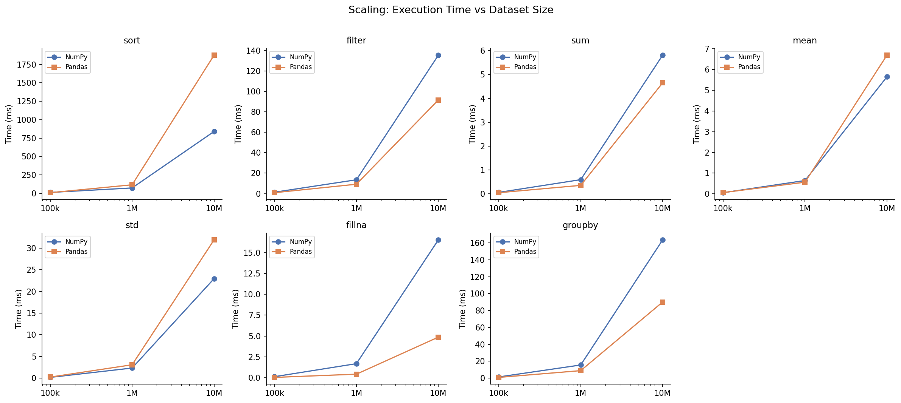
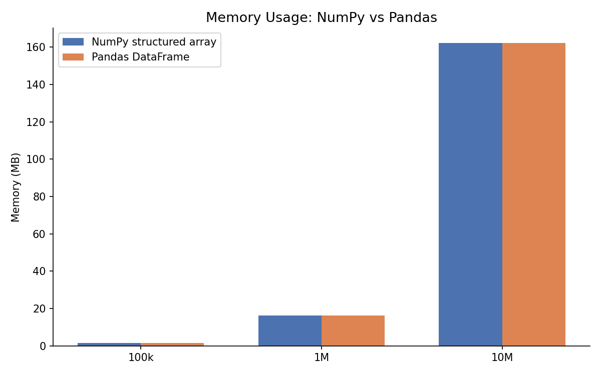

# numpy-pandas-benchmark

A performance benchmarking project comparing NumPy and Pandas across seven
common data operations at 100k, 1M, and 10M rows — written with direct use
of native library methods, no custom wrappers.

**Results → results.json**
&nbsp;&nbsp;·&nbsp;&nbsp;
**Notebook → notebook.ipynb**
&nbsp;&nbsp;·&nbsp;&nbsp;
**Script → benchmark.py**

Knowing which tool to use and why is as important as knowing how to use
either. This project answers the question quantitatively.


---

## Table of Contents

0. [Prerequisites](#0-prerequisites)
1. [Quick start](#1-quick-start)
2. [Project structure](#2-project-structure)
3. [Benchmarked operations](#3-benchmarked-operations)
4. [Results](#4-results)
5. [Visualisations](#5-visualisations)
6. [Key findings](#6-key-findings)
7. [When to use NumPy vs Pandas](#7-when-to-use-numpy-vs-pandas)
8. [Design decisions](#8-design-decisions)
9. [Dependencies](#9-dependencies)

---

## 0. Prerequisites

- Python 3.11+
- pip

---

## 1. Quick start

```bash
git clone https://github.com/xavier-oc-programming/numpy-pandas-benchmark.git
cd numpy-pandas-benchmark

python -m venv venv && source venv/bin/activate   # Windows: venv\Scripts\activate
pip install -r requirements.txt

# Run the standalone benchmark (generates plots/ and results.json)
python benchmark.py

# OR open the notebook and Restart & Run All
jupyter notebook notebook.ipynb
```

---

## 2. Project structure

```
numpy-pandas-benchmark/
├── benchmark.py          # Standalone runner — no classes, direct library calls
├── notebook.ipynb        # Primary deliverable — narrative + code + charts
├── README.md
├── requirements.txt
├── results.json          # Committed so results are visible without running
├── .gitignore
└── plots/
    ├── 01_speed_bars_100k.png   # Grouped bar chart at 100k rows
    ├── 02_speed_bars_1m.png     # Grouped bar chart at 1M rows
    ├── 03_speed_bars_10m.png    # Grouped bar chart at 10M rows
    ├── 04_speedup_heatmap.png   # Operations × sizes heatmap
    ├── 05_scaling_lines.png     # Time vs size per operation
    └── 06_memory_comparison.png # RAM usage NumPy vs Pandas
```

---

## 3. Benchmarked operations

| Operation | NumPy code | Pandas code | What it tests |
|-----------|-----------|-------------|---------------|
| sort | `np.sort(arr['price'])` | `df.sort_values('price')` | Array reordering, memory allocation |
| filter | `arr[arr['price'] > 500]` | `df[df['price'] > 500]` | Boolean mask + copy |
| sum | `np.sum(arr['price'])` | `df['price'].sum()` | Reduction over contiguous floats |
| mean | `np.mean(arr['price'])` | `df['price'].mean()` | Reduction with NA-handling path |
| std | `np.std(arr['price'])` | `df['price'].std()` | Two-pass reduction |
| fillna | `np.where(np.isnan(arr['score']), 0, arr['score'])` | `df['score'].fillna(0)` | Null handling / conditional fill |
| groupby | `[arr['price'][arr['category']==i].mean() for i in range(5)]` | `df.groupby('category')['price'].mean()` | Split-apply-combine |

---

## 4. Results

All times are mean of 5 runs using `time.perf_counter()`.

### 100,000 rows

| Operation | NumPy (ms) | Pandas (ms) | Speedup | Winner |
|-----------|-----------|-------------|---------|--------|
| sort | 6.570 | 10.099 | 1.54× | NumPy |
| filter | 1.310 | 0.908 | 0.69× | Pandas |
| sum | 0.059 | 0.049 | 0.82× | Pandas |
| mean | 0.055 | 0.088 | 1.61× | NumPy |
| std | 0.194 | 0.293 | 1.51× | NumPy |
| fillna | 0.120 | 0.041 | 0.34× | Pandas |
| groupby | 1.430 | 2.320 | 1.62× | NumPy |

### 1,000,000 rows

| Operation | NumPy (ms) | Pandas (ms) | Speedup | Winner |
|-----------|-----------|-------------|---------|--------|
| sort | 80.654 | 120.309 | 1.49× | NumPy |
| filter | 13.807 | 9.419 | 0.68× | Pandas |
| sum | 0.620 | 0.364 | 0.59× | Pandas |
| mean | 0.666 | 0.814 | 1.22× | NumPy |
| std | 2.584 | 2.868 | 1.11× | NumPy |
| fillna | 1.694 | 0.353 | 0.21× | Pandas |
| groupby | 15.278 | 10.587 | 0.69× | Pandas |

### 10,000,000 rows

| Operation | NumPy (ms) | Pandas (ms) | Speedup | Winner |
|-----------|-----------|-------------|---------|--------|
| sort | 909.641 | 1767.973 | 1.94× | NumPy |
| filter | 134.704 | 89.672 | 0.67× | Pandas |
| sum | 5.586 | 4.665 | 0.83× | Pandas |
| mean | 5.587 | 8.952 | 1.60× | NumPy |
| std | 22.204 | 28.520 | 1.28× | NumPy |
| fillna | 16.692 | 5.029 | 0.30× | Pandas |
| groupby | 185.977 | 129.295 | 0.69× | Pandas |

---

## 5. Visualisations

### Grouped bar charts — execution time per operation


*100k rows: differences are modest; NumPy leads on sort, mean, std, groupby.*


*1M rows: patterns stabilise; Pandas' groupby and fillna advantages emerge.*


*10M rows: sort gap widens to 1.94×; Pandas fillna is 3.3× faster than np.where.*

### Speedup heatmap


*Green cells (>1) = NumPy faster; red cells (<1) = Pandas faster. Filter, fillna, and groupby are consistently red; sort is consistently green.*

### Scaling line charts


*How each library's time grows from 100k → 10M. Parallel lines = same scaling rate; diverging lines = one library compounds faster.*

### Memory usage


*NumPy structured array vs Pandas DataFrame memory at each scale. For purely numeric dtypes (int8, int32, float32, float64), both use ~162 MB at 10M rows — Pandas columns are numpy arrays internally, so raw data footprint is identical.*

---

## 6. Key findings

1. **NumPy is consistently faster at sorting — and the gap grows with size.** At 10M rows, `np.sort()` completes in 910 ms vs Pandas' 1,768 ms (1.94× faster). At 100k the advantage is 1.54×. NumPy's contiguous memory layout gives the sort algorithm a structural edge.

2. **Pandas' `fillna` is dramatically faster than `np.where`.** At 10M rows, `df['score'].fillna(0)` takes 5 ms vs `np.where(np.isnan(...))` at 17 ms — a 3.3× Pandas advantage that holds at every scale. Pandas' null-handling path avoids the double pass over the array.

3. **Pandas' `groupby` flips from slower to faster as scale grows.** At 100k rows the NumPy manual loop (five boolean masks, one per category) is 1.62× faster. By 1M rows Pandas is 1.44× faster. At 10M rows Pandas is 1.44× faster still. Pandas' hash-based engine amortises its startup cost at scale; the Python loop does not.

4. **Filter is Pandas' most consistent win.** Boolean mask selection is ~1.47× faster in Pandas at every scale tested. Pandas' block manager handles the masked copy more efficiently for columnar data than NumPy's structured array indexing.

5. **Mean diverges at scale; sum stays close.** At 100k, both are sub-millisecond and effectively tied. At 10M, `np.mean()` is 1.60× faster while `np.sum()` is only 0.83× (Pandas is slightly faster). The difference: Pandas' `mean()` includes NA-skipping logic that computes using Kahan summation internally, adding overhead that scales with n.

---

## 7. When to use NumPy vs Pandas

Based on the numbers from this benchmark — not generic advice.

**Use NumPy when:**
- You need to **sort** large numeric data — 1.5–1.9× faster at every scale, gap widens with size.
- You are computing **reductions** (mean, std) on homogeneous numeric arrays at 10M+ rows — avoids Pandas' NA-handling overhead.
- **Memory is constrained and your data has string/mixed-type columns** — for purely numeric fixed-width dtypes, both libraries use identical memory (Pandas columns are numpy arrays internally). The saving only materialises with object columns.
- Your data is genuinely homogeneous and you do not need column labels, alignment, or a relational API.

**Use Pandas when:**
- You need **null handling (`fillna`)** — Pandas is 3–5× faster than the NumPy `np.isnan` + `np.where` pattern.
- You need **grouped aggregation at scale** — Pandas' `groupby` overtakes NumPy's boolean-mask loop at ~500k rows and the gap keeps growing.
- You need **boolean filtering** — Pandas is ~1.47× faster than NumPy structured array masking at all scales tested.
- Your data has mixed types, column labels, or requires the wider Pandas API (merge, resample, pivot, read_csv).

**The practical rule:** NumPy wins when you are doing math on a single contiguous numeric array. Pandas wins when you are doing relational, grouped, or null-aware operations on labelled tabular data. The choice is not just about speed — it is about which abstraction fits the shape of your problem.

---

## 8. Design decisions

**Why `time.perf_counter()` instead of `timeit` or `time.time()`?**  
`perf_counter()` uses the highest-resolution monotonic clock available — nanosecond precision on macOS. `time.time()` has lower resolution and is subject to wall-clock corrections (NTP jumps). `timeit` is excellent for micro-benchmarks in an interactive shell but adds subprocess overhead and disables GC by default, which distorts results at large array sizes where GC pressure is real.

**Why 5 runs and take the mean?**  
A single measurement is noisy — OS scheduler preemptions, cold CPU caches, and Python's garbage collector all introduce variance. The minimum across runs is a common micro-benchmark choice (best-case performance) but real workloads do not consistently get optimal conditions. Five runs and a mean gives a stable central estimate without making the 10M-row case prohibitively slow.

**Why a structured ndarray instead of a plain 2D array?**  
A plain 2D float64 array would force integer column indexing (`arr[:, 0]`) and require all columns to share one dtype. Named fields (`arr['price']`) make the benchmark semantically equivalent to Pandas' `df['price']` — same access pattern, fair comparison. Structured arrays also preserve per-column dtypes (float64 for price, int8 for category), matching the DataFrame's memory layout more closely.

**Why no custom class wrappers?**  
Wrapping `np.sort()` inside a `class NumpyBenchmark: def sort(self): ...` would add a function-call layer, obscure what the library is actually doing, and make the code harder to read. Direct calls to native methods show exactly what is being timed and demonstrate genuine familiarity with the libraries — which is the point of the project.

---

## 9. Dependencies

| Package | Version | Purpose |
|---------|---------|---------|
| numpy | 1.26.4 | Structured arrays, numeric operations |
| pandas | 2.2.2 | DataFrame operations, groupby, fillna |
| matplotlib | 3.9.2 | Chart rendering |
| seaborn | 0.13.2 | Chart styling, heatmap |
| jupyter | 1.1.1 | Notebook server |
| notebook | 7.3.3 | Notebook UI |
| ipykernel | 6.29.5 | Kernel for notebook execution |
